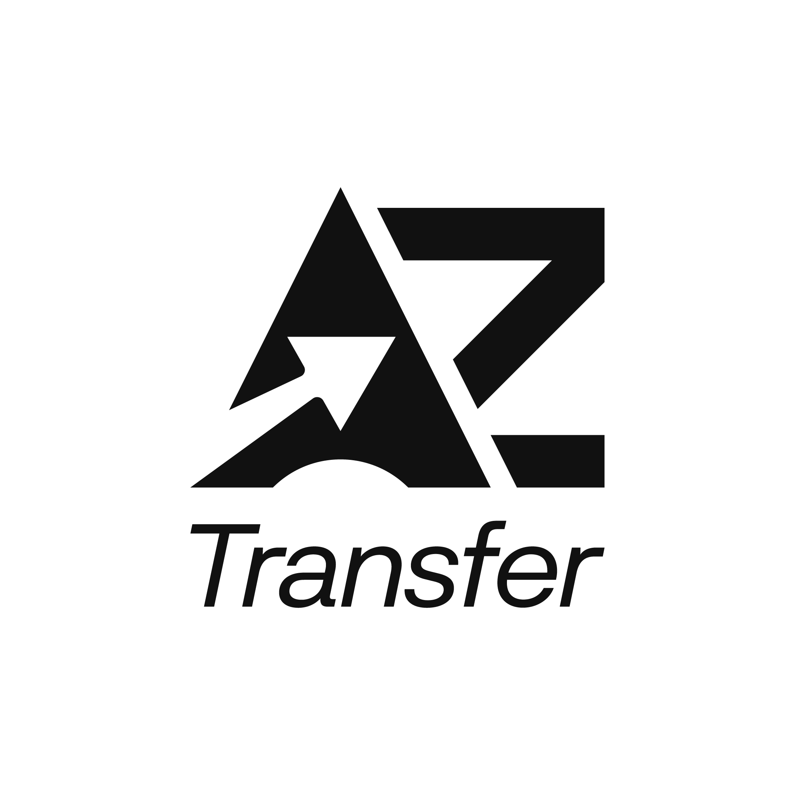

# 🚗 AZ Transfer - Painel Administrativo

Sistema completo de gestão para empresa de transporte executivo, desenvolvido com Next.js 14, Supabase e Tailwind CSS.



## 📋 Sobre o Projeto

O AZ Transfer Dashboard é uma solução completa para gestão de empresa de transporte executivo que inclui:

- **Landing Page Multilíngue** (Português, Inglês, Espanhol)
- **Sistema de Reservas Online** 
- **Painel Administrativo Completo**
- **Autenticação Segura**
- **Gestão de Veículos, Motoristas e Preços**

## 🚀 Funcionalidades

### 🌐 Landing Page
- ✅ Design responsivo e moderno
- ✅ Suporte a 3 idiomas (pt, en, es)
- ✅ Integração com sistema de reservas
- ✅ Otimizada para SEO
- ✅ Formulário de contato

### 📱 Sistema de Reservas
- ✅ Seleção de veículos com preços dinâmicos
- ✅ Extras e serviços adicionais
- ✅ Cálculo automático de preços
- ✅ Confirmação por email
- ✅ Página de confirmação detalhada

### 🎛️ Painel Administrativo
- ✅ Dashboard com métricas em tempo real
- ✅ Gestão completa de reservas
- ✅ Calendário integrado com visualização de viagens
- ✅ CRUD de veículos com upload de imagens
- ✅ Gestão de motoristas
- ✅ Sistema de preços flexível
- ✅ Relatórios e analytics
- ✅ Configurações de perfil com upload de avatar

### 🔐 Autenticação e Segurança
- ✅ Login seguro via Supabase Auth
- ✅ Proteção de rotas administrativas
- ✅ Alteração de senha
- ✅ Gestão de sessões
- ✅ Middleware de autenticação

## 🛠️ Tecnologias Utilizadas

### Frontend
- **Next.js 14** - Framework React com App Router
- **TypeScript** - Tipagem estática
- **Tailwind CSS** - Framework CSS utilitário
- **Lucide React** - Biblioteca de ícones
- **SWR** - Data fetching com cache
- **React Hook Form** - Gerenciamento de formulários

### Backend
- **Supabase** - Backend as a Service
  - Autenticação
  - Banco de dados PostgreSQL
  - Storage para imagens
  - Real-time subscriptions

### Infraestrutura
- **Vercel** - Deploy e hosting
- **Middleware** - Roteamento internacionalizado
- **PWA** - Progressive Web App

## 📊 Estrutura do Banco de Dados

```sql
-- Tabelas principais
- bookings (reservas)
- vehicles (veículos)
- drivers (motoristas)
- pricing_rules (regras de preço)
- extras (serviços extras)
- user_metadata (dados do usuário)
```

## 🏗️ Arquitetura do Projeto

```
projeto-transfer-dashbord/
├── app/                          # App Router (Next.js 14)
│   ├── [lang]/                   # Páginas internacionalizadas
│   │   ├── page.tsx             # Landing page
│   │   ├── layout.tsx           # Layout principal
│   │   └── globals.css          # Estilos globais
│   ├── admin/                   # Painel administrativo
│   │   ├── layout.tsx           # Layout do admin
│   │   ├── page.tsx             # Dashboard
│   │   ├── login/               # Autenticação
│   │   ├── bookings/            # Gestão de reservas
│   │   ├── vehicles/            # Gestão de veículos
│   │   ├── drivers/             # Gestão de motoristas
│   │   ├── pricing/             # Gestão de preços
│   │   ├── reports/             # Relatórios
│   │   └── settings/            # Configurações
│   └── booking/                 # Sistema de reservas
├── components/                  # Componentes reutilizáveis
├── hooks/                       # Custom hooks
├── lib/                         # Utilitários e configurações
├── contexts/                    # Context providers
├── public/                      # Assets estáticos
│   └── img/                     # Imagens
└── middleware.ts                # Middleware de roteamento
```

## 🚀 Instalação e Configuração

### Pré-requisitos
- Node.js 18+ 
- npm ou yarn
- Conta no Supabase

### 1. Clone o repositório
```bash
git clone https://github.com/seu-usuario/projeto-transfer-dashbord.git
cd projeto-transfer-dashbord
```

### 2. Instale as dependências
```bash
npm install
# ou
yarn install
```

### 3. Configure as variáveis de ambiente
```bash
cp .env.example .env.local
```

Preencha o arquivo `.env.local`:
```env
NEXT_PUBLIC_SUPABASE_URL=sua_url_do_supabase
NEXT_PUBLIC_SUPABASE_ANON_KEY=sua_chave_anonima_do_supabase
```

### 4. Configure o Supabase

#### Crie as tabelas no banco:
```sql
-- Executar no SQL Editor do Supabase
-- [SQL schema completo disponível em /docs/database.sql]
```

#### Crie um usuário administrador:
```sql
-- Criar usuário admin
INSERT INTO auth.users (email, encrypted_password, email_confirmed_at)
VALUES ('admin@aztransfer.com', crypt('sua_senha_aqui', gen_salt('bf')), now());
```

### 5. Execute o projeto
```bash
npm run dev
# ou 
yarn dev
```

Acesse:
- **Landing Page**: http://localhost:3000
- **Sistema de Reservas**: http://localhost:3000/booking  
- **Painel Admin**: http://localhost:3000/admin

## 📱 Funcionalidades Detalhadas

### Dashboard Administrativo
- **Métricas em tempo real**: Total de reservas, receita, veículos ativos
- **Gráficos**: Reservas por mês, receita por período
- **Atividade recente**: Últimas reservas e atualizações

### Gestão de Reservas
- **Visualização em lista e calendário**
- **Filtros avançados**: Por status, data, veículo
- **Detalhes completos**: Cliente, itinerário, pagamento
- **Atualização de status**: Pendente → Confirmada → Concluída

### Gestão de Veículos
- **CRUD completo**: Criar, editar, visualizar, excluir
- **Upload de imagens**: Múltiplas fotos por veículo
- **Informações técnicas**: Capacidade, tipo, status
- **Controle de disponibilidade**

### Sistema de Preços
- **Preços dinâmicos**: Por tipo de veículo, distância, horário
- **Extras configuráveis**: Serviços adicionais
- **Regras personalizadas**: Descontos, promoções

### Relatórios
- **Receita por período**
- **Veículos mais utilizados**
- **Performance dos motoristas**
- **Exportação em PDF/Excel**

## 🎨 Customização

### Cores e Branding
```css
/* tailwind.config.js */
colors: {
  primary: '#1a365d',      // Azul escuro
  secondary: '#E95440',    // Vermelho/laranja
  background: {
    light: '#f7fafc',      // Cinza claro
    white: '#ffffff',      // Branco
    dark: '#2d3748',       // Cinza escuro
  }
}
```

### Logo e Favicon
- Logo: `public/img/logo.png`
- Favicon: `public/img/favicon.png`

## 📦 Deploy

### Vercel (Recomendado)
```bash
# Conecte seu repositório ao Vercel
# Configure as variáveis de ambiente
# Deploy automático a cada push
```

### Outras Plataformas
- **Netlify**: Configure build command como `npm run build`
- **Railway**: Conecte o repositório GitHub
- **Digital Ocean**: Use Docker ou deploy direto

## 🔧 Scripts Disponíveis

```bash
npm run dev          # Servidor de desenvolvimento
npm run build        # Build para produção
npm run start        # Servidor de produção
npm run lint         # Verificar código
npm run type-check   # Verificar tipos TypeScript
```

## 📚 Documentação da API

### Endpoints Principais (Supabase)
- `GET /bookings` - Listar reservas
- `POST /bookings` - Criar reserva
- `PUT /bookings/:id` - Atualizar reserva
- `GET /vehicles` - Listar veículos
- `POST /vehicles` - Criar veículo

### Hooks Customizados
- `useBookings()` - Gestão de reservas
- `useVehicles()` - Gestão de veículos
- `useAdmin()` - Autenticação admin
- `usePricingRules()` - Regras de preço

## 🐛 Solução de Problemas

### Problemas Comuns

**1. Erro de autenticação**
```bash
# Verifique as variáveis de ambiente
# Confirme as configurações do Supabase
```

**2. Imagens não carregam**
```bash
# Verifique se os arquivos estão em public/img/
# Confirme as configurações do middleware
```

**3. Build falha**
```bash
npm run type-check  # Verificar erros de tipo
npm run lint        # Verificar erros de código
```

## 🤝 Contribuição

1. Fork o projeto
2. Crie uma branch (`git checkout -b feature/nova-funcionalidade`)
3. Commit suas mudanças (`git commit -m 'Adiciona nova funcionalidade'`)
4. Push para a branch (`git push origin feature/nova-funcionalidade`)
5. Abra um Pull Request

## 📄 Licença

Este projeto está sob a licença MIT. Veja o arquivo [LICENSE](LICENSE) para mais detalhes.

## 👥 Equipe

- **Desenvolvedor Principal**: [Seu Nome]
- **UI/UX Design**: [Designer]
- **Cliente**: AZ Transfer

## 📞 Suporte

Para suporte técnico:
- 📧 Email: suporte@aztransfer.com
- 💬 Discord: [Link do servidor]
- 📱 WhatsApp: +55 (11) 99999-9999

---

**Desenvolvido com ❤️ para AZ Transfer**